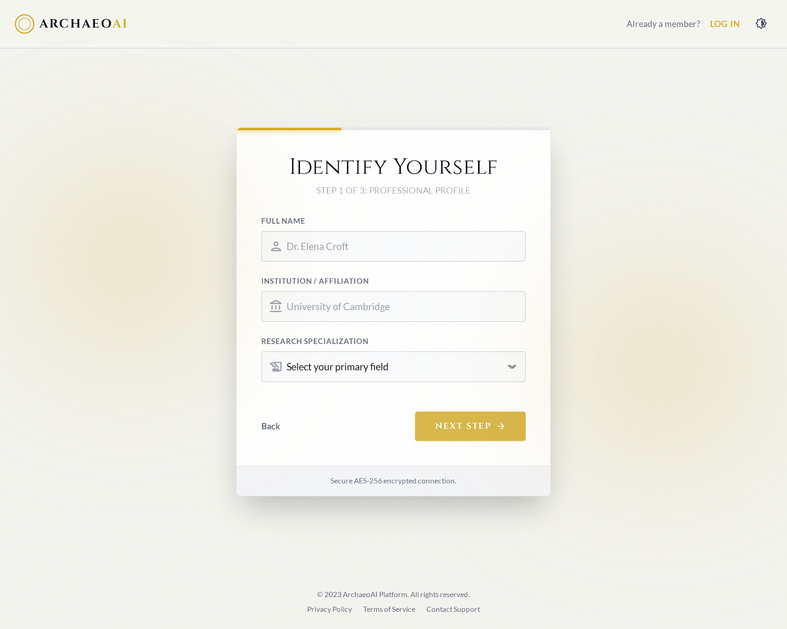
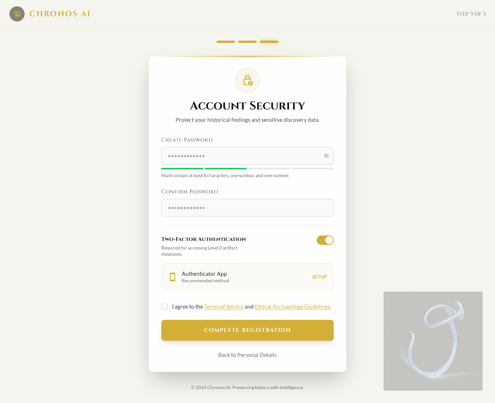

# 🏺 Aletheon: AI-Powered Archaeological Analysis Platform

[](https://nextjs.org/)
[](https://www.typescriptlang.org/)
[](https://supabase.com/)
[](https://www.electronjs.org/)
[](https://maplibre.org/)

**Aletheon** (ArchaeoAI) is a sophisticated, high-fidelity platform engineered for the modern archaeologist. It bridges the gap between traditional field work and advanced computational analysis, providing a comprehensive suite for artifact digitization, AI-driven spectrographic analysis, and global GIS mapping.

---

## 🚀 Key Modules & Features

### 📦 Preservation Vault
The core repository for all digital specimens.
- **Detailed Specimen Reports**: Tracks technical data including material composition, PH levels, and molecular signatures.
- **Integrity Monitoring**: Real-time status tracking (Stable, Critical, Pending) for sensitive artifacts.
- **Sync Protocol**: Secure, institutional-grade synchronization across global nodes.

### 🔬 Artifact Laboratory (AI Analysis)
Leverage cutting-edge AI models for high-fidelity specimen analysis.
- **AI Engine**: Powered by **OpenRouter (DeepSeek R1 Chimera)** for advanced reasoning and scholarly hypothesis generation.
- **Multi-Phase Scanning**:
  1. Initializing Optical Sensors
  2. Spectrographic Signature Mapping
  3. Material Composition Identification
  4. Global Antiquity Database Cross-Referencing (via **Smithsonian Open Access**)
  5. AI-Driven Scholarly Hypothesis Generation
- **Field Observations**: Integrated stratigraphic and contextual note-taking.

### 🗺 Arch-Atlas (GIS)
Advanced geospatial visualization and excavation planning.
- **Temporal Mapping**: Visualize archaeological sites across a timeline from 2000 BCE to 2000 CE.
- **Satellite GPS Linking**: Real-time L-Band satellite synchronization for precise site coordinates.
- **Layer Management**: Toggleable layers for topography, hydrology, and coordinate grids.
- **Excavation Planning**: Define and initialize new extraction protocols directly from the map.

### 👥 Collaboration & Discovery
- **Research Teams**: Manage scholarly groups and institutional permissions.
- **Secure Messaging**: Real-time communication and artifact sharing between researchers.
- **Discovery Engine**: Intelligent search and exploration of the global artifact database, integrated with the **Smithsonian Open Access API** for comparative study.

---

## 🛠 Technology Stack

- **Frontend**: [Next.js](https://nextjs.org/) 15 (App Router), [React](https://react.dev/) 19, [Framer Motion](https://www.framer.com/motion/)
- **Styling**: Tailwind CSS / CSS Modules
- **Backend**: [Supabase](https://supabase.com/) (PostgreSQL, Auth, Real-time RLS)
- **Mapping**: [MapLibre GL](https://maplibre.org/)
- **Desktop**: [Electron](https://www.electronjs.org/)
- **Icons**: [Lucide React](https://lucide.dev/)

---

## 🏁 Getting Started

### Prerequisites
- Node.js (Latest LTS)
- NPM or Bun
- A Supabase account and project

### Installation

1. **Clone the repository**:
   ```bash
   git clone https://github.com/your-org/aletheon.git
   cd aletheon
   ```

2. **Install dependencies**:
   ```bash
   npm install
   ```

3. **Environment Configuration**:
   Create a `.env.local` file in the root directory and populate it with your API keys:
   ```env
   # Supabase
   NEXT_PUBLIC_SUPABASE_URL=your_supabase_url
   NEXT_PUBLIC_SUPABASE_ANON_KEY=your_anon_key
   SUPABASE_SERVICE_ROLE_KEY=your_service_role_key

   # AI Analysis (OpenRouter)
   OPENROUTER_API_KEY=your_openrouter_key
   OPENROUTER_MODEL=tngtech/deepseek-r1t2-chimera:free

   # Smithsonian Data
   SMITHSONIAN_API_KEY=your_smithsonian_key
   ```

4. **Database Setup**:
   - Create a new project in [Supabase](https://app.supabase.com/).
   - Execute the contents of `schema.sql` in the Supabase SQL Editor.

### Running Locally

**Web Development:**
```bash
npm run dev
```

**Electron Development:**
```bash
npm run electron:dev
```

### Building for Production

**Web Build:**
```bash
npm run build
```

**Desktop Build:**
```bash
npm run electron:build
```

---

## 📊 Database Architecture
Aletheon utilizes a robust PostgreSQL schema managed via Supabase:
- `profiles`: Extended user metadata and institutional affiliations.
- `artifacts`: Core specimen data, including AI-generated reports and metadata.
- `artifact_images`: High-resolution imagery for specimens.
- `groups` & `group_members`: Team management and permissions.
- `messages`: Real-time collaborative communication.

---

## 📸 Interface Preview

<div align="center">
  
  
  <br />
  
  
</div>

*(For more detailed views, please refer to the `/screenshots` directory)*

---

## 📄 License
This project is licensed under the MIT License - see the LICENSE file for details.

---
© 2025 Aletheon Development Team | Securing the Past for the Future.
